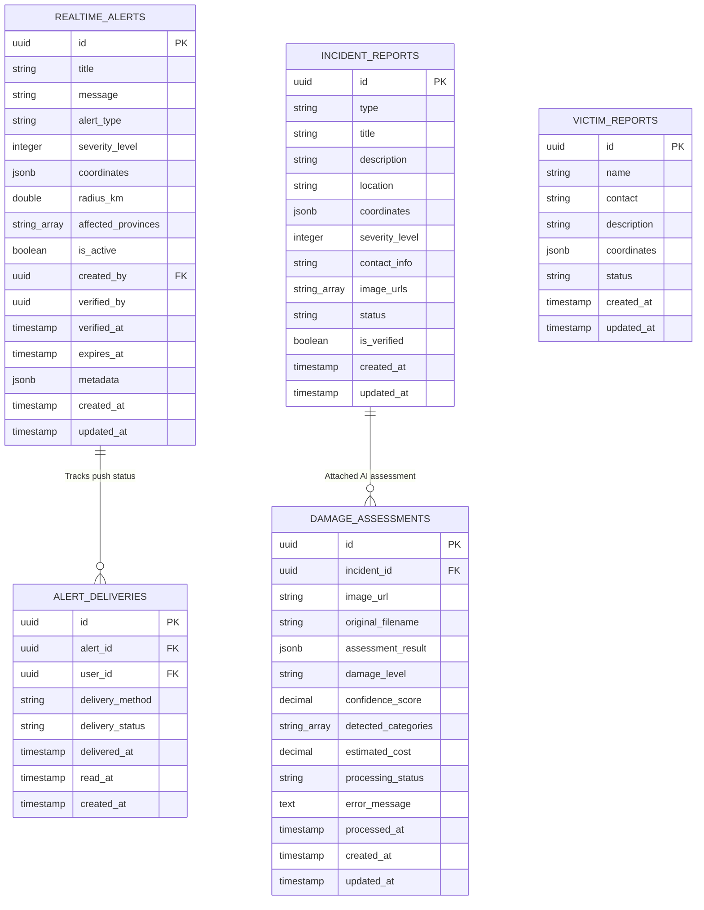
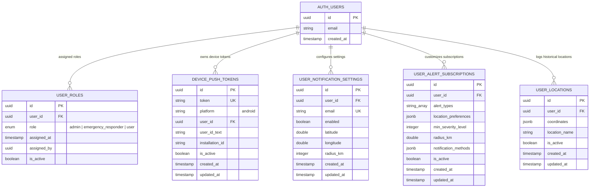
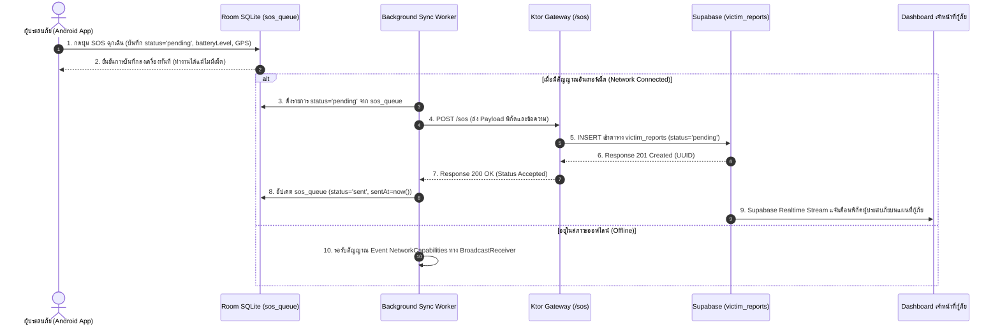
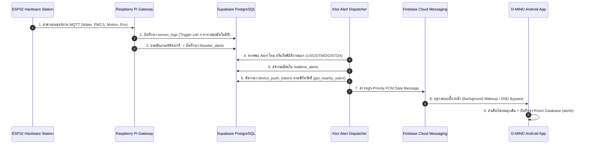

# 🗺️ D-MIND: Complete Database ER Diagram & Architecture Specification
**ระบบฐานข้อมูลร่วมสำหรับ Android Native App, IoT Station และ Backend Gateway**  
**เวอร์ชัน:** 2.0 (Production Master Schema)  
**วันที่จัดทำ:** 1 กันยายน 2026  

---

## 📑 สารบัญ (Table of Contents)
1. [ภาพรวมสถาปัตยกรรมฐานข้อมูล (Database Architecture Overview)](#1-ภาพรวมสถาปัตยกรรมฐานข้อมูล-database-architecture-overview)
2. [แผนภาพ ER Diagram รวมทั้งระบบ (System-Wide Master ER Diagram)](#2-แผนภาพ-er-diagram-รวมทั้งระบบ-system-wide-master-er-diagram)
3. [แผนภาพ ER Diagram แยกตามโมดูลหลัก (Subsystem ER Diagrams)](#3-แผนภาพ-er-diagram-แยกตามโมดูลหลัก-subsystem-er-diagrams)
   - 3.1 [โมดูลสถานีตรวจวัดและโทรมาตรภาคสนาม (IoT Station & Telemetry Subsystem)](#31-โมดูลสถานีตรวจวัดและโทรมาตรภาคสนาม-iot-station--telemetry-subsystem)
   - 3.2 [โมดูลศูนย์เตือนภัยและแจ้งเหตุฉุกเฉิน (Disaster Alert & Incident Subsystem)](#32-โมดูลศูนย์เตือนภัยและแจ้งเหตุฉุกเฉิน-disaster-alert--incident-subsystem)
   - 3.3 [โมดูลผู้ใช้งาน การแจ้งเตือน และสิทธิ์ความปลอดภัย (User, FCM & Auth Subsystem)](#33-โมดูลผู้ใช้งาน-การแจ้งเตือน-และสิทธิ์ความปลอดภัย-user-fcm--auth-subsystem)
   - 3.4 [โมดูลฐานข้อมูลออฟไลน์บนมือถือ (Android Local Room SQLite Subsystem)](#34-โมดูลฐานข้อมูลออฟไลน์บนมือถือ-android-local-room-sqlite-subsystem)
4. [พจนานุกรมข้อมูลและโครงสร้างตาราง (Data Dictionary & Table Schemas)](#4-พจนานุกรมข้อมูลและโครงสร้างตาราง-data-dictionary--table-schemas)
5. [เมทริกซ์ความสัมพันธ์และการส่งต่อข้อมูล (Entity Relationships & Data Flow Matrix)](#5-เมทริกซ์ความสัมพันธ์และการส่งต่อข้อมูล-entity-relationships--data-flow-matrix)
6. [ยุทธศาสตร์การซิงค์ข้อมูล Cloud <-> Local (Offline Sync & Synchronization Strategy)](#6-ยุทธศาสตร์การซิงค์ข้อมูล-cloud---local-offline-sync--synchronization-strategy)

---

## 1. ภาพรวมสถาปัตยกรรมฐานข้อมูล (Database Architecture Overview)

ระบบฐานข้อมูลโครงการ **D-MIND (Disaster Management & Information System)** ถูกออกแบบเป็นสถาปัตยกรรมแบบ **Hybrid Distributed Database** เพื่อรองรับการทำงานแบบเรียลไทม์ (Real-time), ความพร้อมใช้งานสูง (High Availability) และการทำงานในสภาวะออฟไลน์ (Offline-First Resiliency) แบ่งออกเป็น 2 เลเยอร์หลัก:

```mermaid
flowchart TD
    subgraph IoT_Hardware["📡 IoT Field Stations"]
        ESP32["ESP32 Microcontroller\n(4 Sensors: Water, Dust, Motion, Env)"]
        RPi["Raspberry Pi Gateway\n(FastAPI + MQTT Broker + Alert Engine)"]
    end

    subgraph Central_Cloud["☁️ Central Cloud Database (PostgreSQL / Supabase)"]
        subgraph IoT_Tables["IoT & Telemetry Layer"]
            T_sensor_logs["sensor_logs (Master)"]
            T_water["water_level_logs"]
            T_pm["pm_logs"]
            T_motion["motion_logs"]
            T_env["environment_logs"]
            T_iot_alerts["disaster_alerts"]
            T_api_keys["api_keys"]
        end

        subgraph Core_Tables["Disaster, User & Incident Layer"]
            T_users["auth.users (Supabase Auth)"]
            T_roles["user_roles (RBAC)"]
            T_realtime_alerts["realtime_alerts"]
            T_alert_deliv["alert_deliveries"]
            T_incident["incident_reports"]
            T_damage["damage_assessments"]
            T_victim["victim_reports (SOS)"]
            T_fcm["device_push_tokens"]
            T_notif_set["user_notification_settings"]
            T_analytics["analytics_data"]
            T_articles["articles"]
        end
    end

    subgraph Backend_Gateway["⚡ Backend Gateway (Kotlin / Ktor)"]
        KtorServer["Ktor REST API + Background Alert Dispatcher"]
    end

    subgraph Mobile_App["📱 Android Native Mobile App (Kotlin / Compose)"]
        AppClient["D-MIND Android Client"]
        subgraph Local_Room["Local Room SQLite (Offline Cache)"]
            L_alerts["alerts (Cache)"]
            L_sos["sos_queue (Pending SOS)"]
            L_zones["danger_zones (Geofence Polygons)"]
            L_loc["location_history (GPS Breadcrumbs)"]
        end
    end

    ESP32 -->|MQTT / JSON| RPi
    RPi -->|FastAPI Ingest / SQL| T_sensor_logs
    RPi -->|Alert Evaluation| T_iot_alerts
    T_sensor_logs -.->|Trigger: sync_sensor_logs| T_water & T_pm & T_motion & T_env

    KtorServer <-->|PostgREST / Service Role| Central_Cloud
    AppClient <-->|REST API / Supabase SDK| Central_Cloud
    AppClient <-->|Gateway Proxy / Health| KtorServer
    AppClient -->|Read/Write Offline| Local_Room
    L_sos -.->|Sync when Online| T_victim
    T_realtime_alerts -.->|Cache for Offline| L_alerts
    T_realtime_alerts -.->|Polygon Geofence Sync| L_zones
```



---

## 2. แผนภาพ ER Diagram รวมทั้งระบบ (System-Wide Master ER Diagram)

ด้านล่างคือแผนภาพความสัมพันธ์ของเอนทิตี (ER Diagram) ฉบับสมบูรณ์ แสดงตารางทั้งหมดทั้งบน Central Supabase Cloud และ Android Room SQLite:

```mermaid
erDiagram
    %% ==========================================
    %% 1. AUTH & USER MANAGEMENT
    %% ==========================================
    AUTH_USERS {
        uuid id PK "Supabase Auth UID"
        string email "User email address"
        timestamp created_at "Registration timestamp"
    }

    USER_ROLES {
        uuid id PK "Unique Role Assignment ID"
        uuid user_id FK "References auth.users(id)"
        enum role "admin | emergency_responder | user"
        timestamp assigned_at "Assignment timestamp"
        uuid assigned_by "Admin user who assigned role"
        boolean is_active "Active status"
    }

    USER_LOCATIONS {
        uuid id PK "Unique Location ID"
        uuid user_id FK "References auth.users(id)"
        jsonb coordinates "{lat, lng}"
        string location_name "Label / District / Province"
        boolean is_active "Active state"
        timestamp created_at "Timestamp"
        timestamp updated_at "Update timestamp"
    }

    USER_NOTIFICATION_SETTINGS {
        uuid id PK "Settings ID"
        uuid user_id FK "References auth.users(id) [Nullable]"
        string email UK "Notification Email"
        boolean enabled "Global toggle"
        double latitude "Home/Work Latitude"
        double longitude "Home/Work Longitude"
        integer radius_km "Alert Radius in km (Default 10)"
        timestamp created_at "Creation timestamp"
        timestamp updated_at "Update timestamp"
    }

    USER_ALERT_SUBSCRIPTIONS {
        uuid id PK "Subscription ID"
        uuid user_id FK "References auth.users(id)"
        string_array alert_types "Array of subscribed types"
        jsonb location_preferences "{lat, lng, label}"
        integer min_severity_level "Minimum severity (1-5)"
        double radius_km "Subscription radius"
        jsonb notification_methods "{push, email, sms}"
        boolean is_active "Active toggle"
        timestamp created_at "Creation timestamp"
        timestamp updated_at "Update timestamp"
    }

    DEVICE_PUSH_TOKENS {
        uuid id PK "Token Record ID"
        string token UK "FCM Device Push Token"
        string platform "Platform: 'android'"
        uuid user_id FK "References auth.users(id) [Nullable]"
        string user_id_text "Fallback client ID"
        string installation_id "Unique app install ID"
        boolean is_active "Active token status"
        timestamp created_at "Registered at"
        timestamp updated_at "Last refreshed at"
    }

    %% ==========================================
    %% 2. IOT STATION & TELEMETRY SUBSYSTEM
    %% ==========================================
    API_KEYS {
        uuid id PK "Unique Key ID"
        string key_name "Friendly Name / Purpose"
        string key_prefix "Prefix for lookup (dmind_live_...)"
        string hashed_key UK "SHA-256 Hash of raw API key"
        integer rate_limit_rpm "Rate limit per minute (Default 120)"
        boolean is_active "Soft revocation flag"
        text description "Usage description"
        timestamp expires_at "Expiry datetime (Null=Permanent)"
        timestamp last_used_at "Last request timestamp"
        bigint total_requests "Total request counter"
        timestamp created_at "Creation timestamp"
    }

    SENSOR_LOGS {
        integer id PK "Auto-increment Log ID"
        timestamp timestamp "Measurement datetime"
        double water_level "Water level in cm (AJ-SR04M)"
        double pm1 "PM 1.0 in ug/m3 (PMS5003)"
        double pm25 "PM 2.5 in ug/m3 (PMS5003)"
        double pm10 "PM 10 in ug/m3 (PMS5003)"
        double pitch "Tilt Pitch angle in deg (GY-521)"
        double roll "Tilt Roll angle in deg (GY-521)"
        double yaw "Yaw orientation in deg (GY-521)"
        double acc_x "X-axis Acceleration in g (GY-521)"
        double acc_y "Y-axis Acceleration in g (GY-521)"
        double acc_z "Z-axis Acceleration in g (GY-521)"
        double gyro_x "X-axis Angular velocity (GY-521)"
        double gyro_y "Y-axis Angular velocity (GY-521)"
        double gyro_z "Z-axis Angular velocity (GY-521)"
        double temperature "Ambient Temperature in C (BME280)"
        double humidity "Relative Humidity % (BME280)"
        double pressure "Barometric Pressure in hPa (BME280)"
    }

    WATER_LEVEL_LOGS {
        integer id PK "Log ID"
        timestamp timestamp "Measurement time"
        double water_level "Water level in cm"
        double distance_cm "Raw sensor head distance"
        string status "NORMAL | WARNING | CRITICAL"
        string device_id "Hardware Station ID"
    }

    PM_LOGS {
        integer id PK "Log ID"
        timestamp timestamp "Measurement time"
        double pm1 "PM1.0 ug/m3"
        double pm25 "PM2.5 ug/m3"
        double pm10 "PM10 ug/m3"
        string aqi_category "Good | Moderate | Unhealthy | Hazardous"
        string device_id "Hardware Station ID"
    }

    MOTION_LOGS {
        integer id PK "Log ID"
        timestamp timestamp "Measurement time"
        double pitch "Pitch angle"
        double roll "Roll angle"
        double yaw "Yaw angle"
        double acc_x "Acc X"
        double acc_y "Acc Y"
        double acc_z "Acc Z"
        double gyro_x "Gyro X"
        double gyro_y "Gyro Y"
        double gyro_z "Gyro Z"
        double vibration_delta "Abs Deviation from 1.0g"
        boolean is_anomaly "Anomaly detection flag"
        string device_id "Hardware Station ID"
    }

    ENVIRONMENT_LOGS {
        integer id PK "Log ID"
        timestamp timestamp "Measurement time"
        double temperature "Temperature in C"
        double humidity "Humidity in %"
        double pressure "Pressure in hPa"
        double heat_index "Calculated Heat Index C"
        double dew_point "Calculated Dew Point C"
        string device_id "Hardware Station ID"
    }

    DISASTER_ALERTS {
        integer id PK "Auto-increment Alert ID"
        timestamp timestamp "Triggered timestamp"
        string alert_type "WATER_LEVEL_HIGH | PM25_HIGH | ABNORMAL_VIBRATION"
        string severity "INFO | WARNING | CRITICAL"
        string title "Alert Title"
        string message "Alert Message Body"
        string sensor_name "Sensor Trigger: AJ-SR04M | PMS5003 | GY-521 | BME280"
        double current_value "Measured trigger value"
        double threshold_value "Configured threshold"
        string unit "cm | ug/m3 | g | C"
        boolean is_resolved "Resolution flag"
        timestamp resolved_at "Resolution timestamp"
        string device_id "Origin Station ID"
    }

    %% ==========================================
    %% 3. REALTIME ALERTS & EMERGENCY DISPATCH
    %% ==========================================
    REALTIME_ALERTS {
        uuid id PK "Unique Alert UUID"
        string title "Emergency Title"
        string message "Detailed instructions & alert"
        string alert_type "flood | earthquake | wildfire | storm | air_quality"
        integer severity_level "Severity 1 to 5"
        jsonb coordinates "{lat, lng}"
        double radius_km "Impact Radius in km"
        string_array affected_provinces "List of provinces impacted"
        boolean is_active "Active broadcasting flag"
        uuid created_by FK "References auth.users(id) [Nullable]"
        uuid verified_by "Official Responder ID"
        timestamp verified_at "Official Verification time"
        timestamp expires_at "Expiration datetime"
        jsonb metadata "Extra sensor/API payload"
        timestamp created_at "Created timestamp"
        timestamp updated_at "Updated timestamp"
    }

    ALERT_DELIVERIES {
        uuid id PK "Delivery ID"
        uuid alert_id FK "References realtime_alerts(id)"
        uuid user_id FK "References auth.users(id)"
        string delivery_method "push | email | sms"
        string delivery_status "pending | delivered | failed"
        timestamp delivered_at "FCM delivery timestamp"
        timestamp read_at "User open/read timestamp"
        timestamp created_at "Creation timestamp"
    }

    %% ==========================================
    %% 4. CITIZEN INCIDENTS, AI DAMAGE & SOS
    %% ==========================================
    INCIDENT_REPORTS {
        uuid id PK "Incident Report ID"
        string type "flood | fire | landslide | road_block | storm"
        string title "Report title"
        string description "Detailed description"
        string location "Address / Landmark text"
        jsonb coordinates "{lat, lng}"
        integer severity_level "Severity 1 to 5"
        string contact_info "Reporter phone / contact (Protected)"
        string_array image_urls "Storage URLs in incident-images bucket"
        string status "pending | verified | resolved | rejected"
        boolean is_verified "Responder verification"
        timestamp created_at "Reported time"
        timestamp updated_at "Last updated time"
    }

    DAMAGE_ASSESSMENTS {
        uuid id PK "Assessment ID"
        uuid incident_id FK "References incident_reports(id) [Nullable]"
        string image_url "Storage URL in damage-assessment-images"
        string original_filename "Uploaded image filename"
        jsonb assessment_result "AI Model JSON Detection Payload"
        string damage_level "none | minor | moderate | severe | critical"
        decimal confidence_score "Model confidence 0.0000 - 1.0000"
        string_array detected_categories "e.g. ['collapsed_roof', 'water_damage']"
        decimal estimated_cost "Estimated structural repair cost (THB)"
        string processing_status "pending | processing | completed | failed"
        text error_message "Failure reason if failed"
        timestamp processed_at "Inference completed timestamp"
        timestamp created_at "Creation timestamp"
        timestamp updated_at "Update timestamp"
    }

    VICTIM_REPORTS {
        uuid id PK "SOS Request ID"
        string name "Victim Name / Identifier"
        string contact "Emergency contact number"
        string description "Condition / Medical need"
        jsonb coordinates "{lat, lng}"
        string status "pending | in_progress | rescued | resolved"
        timestamp created_at "SOS Timestamp"
        timestamp updated_at "Status update timestamp"
    }

    %% ==========================================
    %% 5. ARTICLES & ANALYTICS
    %% ==========================================
    ARTICLES {
        uuid id PK "Article ID"
        string title "Article Title"
        string subtitle "Article Subtitle"
        string description "Short summary"
        string image_url "Cover photo URL"
        text content "Markdown / HTML content"
        string type "emergency_article | academic_article | guide"
        string layout_type "auto | manual"
        string slug UK "URL Friendly slug"
        boolean published "Publication toggle"
        uuid author_id FK "References auth.users(id)"
        timestamp created_at "Created at"
        timestamp updated_at "Updated at"
    }

    ANALYTICS_DATA {
        uuid id PK "Metric ID"
        string metric_name "e.g. daily_flood_count"
        numeric metric_value "Numeric metric value"
        string metric_type "disaster_count | severity_dist | station_metric"
        date date_recorded "Aggregation date"
        jsonb location_data "{province, district, station_id}"
        jsonb metadata "Extra calculation attributes"
        timestamp created_at "Record timestamp"
    }

    %% ==========================================
    %% 6. ANDROID LOCAL ROOM SQLITE (OFFLINE CACHE)
    %% ==========================================
    ROOM_ALERTS {
        integer id PK "Auto-generated Local ID"
        string type "Disaster type"
        string level "Alert severity level"
        string title "Alert title"
        string message "Alert message content"
        bigint timestamp "Epoch milliseconds"
        boolean isRead "Local read status toggle"
    }

    ROOM_SOS_QUEUE {
        integer id PK "Auto-generated Queue ID"
        string userId "User ID or Guest UUID"
        double latitude "GPS Latitude"
        double longitude "GPS Longitude"
        integer batteryLevel "Battery % at SOS time"
        string message "SOS Message"
        string status "'pending' | 'sent' | 'failed'"
        bigint createdAt "Creation epoch millis"
        bigint sentAt "Sync epoch millis"
    }

    ROOM_DANGER_ZONES {
        bigint id PK "Zone ID (matches Cloud Alert ID or Hash)"
        string name "Zone Name"
        string type "Disaster type"
        string alertTitle "Zone Alert Title"
        string alertMessage "Zone Alert Message"
        string polygonJson "GeoJSON Polygon coordinates string"
        bigint createdAt "Start epoch millis"
        bigint expiresAt "Expiry epoch millis"
        boolean isEnabled "Active evaluation flag"
    }

    ROOM_LOCATION_HISTORY {
        integer id PK "Auto-increment Breadcrumb ID"
        double latitude "GPS Latitude"
        double longitude "GPS Longitude"
        float accuracy "GPS Accuracy in meters"
        bigint timestamp "GPS Fix epoch millis"
    }

    %% ==========================================
    %% ENTITY RELATIONSHIPS & CARDINALITY
    %% ==========================================
    AUTH_USERS ||--o{ USER_ROLES : "has roles"
    AUTH_USERS ||--o{ USER_LOCATIONS : "tracks locations"
    AUTH_USERS ||--o{ USER_NOTIFICATION_SETTINGS : "configures"
    AUTH_USERS ||--o{ USER_ALERT_SUBSCRIPTIONS : "subscribes"
    AUTH_USERS ||--o{ DEVICE_PUSH_TOKENS : "registers devices"
    AUTH_USERS ||--o{ REALTIME_ALERTS : "creates/issues"
    AUTH_USERS ||--o{ ALERT_DELIVERIES : "receives"
    AUTH_USERS ||--o{ ARTICLES : "authors"

    REALTIME_ALERTS ||--o{ ALERT_DELIVERIES : "delivers to users"
    INCIDENT_REPORTS ||--o{ DAMAGE_ASSESSMENTS : "evaluated by AI"

    %% IoT Database Synchronization & Derived Logs (1:1 per record via trigger)
    SENSOR_LOGS ||--o| WATER_LEVEL_LOGS : "triggers sync"
    SENSOR_LOGS ||--o| PM_LOGS : "triggers sync"
    SENSOR_LOGS ||--o| MOTION_LOGS : "triggers sync"
    SENSOR_LOGS ||--o| ENVIRONMENT_LOGS : "triggers sync"
    SENSOR_LOGS ..> DISASTER_ALERTS : "evaluates thresholds"

    %% Android Local Room Synchronization mapping
    ROOM_SOS_QUEUE ..> VICTIM_REPORTS : "syncs when online"
    REALTIME_ALERTS ..> ROOM_ALERTS : "cached into"
    REALTIME_ALERTS ..> ROOM_DANGER_ZONES : "polygons cached into"
```

---

## 3. แผนภาพ ER Diagram แยกตามโมดูลหลัก (Subsystem ER Diagrams)

### 3.1 โมดูลสถานีตรวจวัดและโทรมาตรภาคสนาม (IoT Station & Telemetry Subsystem)
โครงสร้างตารางที่ใช้จัดการข้อมูลที่ส่งมาจากฮาร์ดแวร์ **ESP32** (4 เซนเซอร์: AJ-SR04M, PMS5003, GY-521, BME280) ผ่าน **Raspberry Pi Gateway (FastAPI + MQTT Broker)** ไปยัง **Supabase**:

```mermaid
erDiagram
    API_KEYS {
        uuid id PK
        string key_name
        string key_prefix
        string hashed_key UK
        integer rate_limit_rpm
        boolean is_active
        text description
        timestamp expires_at
        timestamp last_used_at
        bigint total_requests
        timestamp created_at
    }

    SENSOR_LOGS {
        integer id PK
        timestamp timestamp
        double water_level "AJ-SR04M Ultrasonic"
        double pm1 "PMS5003 Laser"
        double pm25 "PMS5003 Laser"
        double pm10 "PMS5003 Laser"
        double pitch "GY-521 Tilt"
        double roll "GY-521 Tilt"
        double yaw "GY-521 Yaw"
        double acc_x "GY-521 Acc X"
        double acc_y "GY-521 Acc Y"
        double acc_z "GY-521 Acc Z"
        double gyro_x "GY-521 Gyro X"
        double gyro_y "GY-521 Gyro Y"
        double gyro_z "GY-521 Gyro Z"
        double temperature "BME280 Temp"
        double humidity "BME280 Humidity"
        double pressure "BME280 Pressure"
    }

    WATER_LEVEL_LOGS {
        integer id PK
        timestamp timestamp
        double water_level
        double distance_cm
        string status "NORMAL|WARNING|CRITICAL"
        string device_id
    }

    PM_LOGS {
        integer id PK
        timestamp timestamp
        double pm1
        double pm25
        double pm10
        string aqi_category
        string device_id
    }

    MOTION_LOGS {
        integer id PK
        timestamp timestamp
        double pitch
        double roll
        double yaw
        double acc_x
        double acc_y
        double acc_z
        double gyro_x
        double gyro_y
        double gyro_z
        double vibration_delta
        boolean is_anomaly
        string device_id
    }

    ENVIRONMENT_LOGS {
        integer id PK
        timestamp timestamp
        double temperature
        double humidity
        double pressure
        double heat_index
        double dew_point
        string device_id
    }

    DISASTER_ALERTS {
        integer id PK
        timestamp timestamp
        string alert_type
        string severity
        string title
        string message
        string sensor_name
        double current_value
        double threshold_value
        string unit
        boolean is_resolved
        timestamp resolved_at
        string device_id
    }

    SENSOR_LOGS ||--o| WATER_LEVEL_LOGS : "Auto-split via Trigger"
    SENSOR_LOGS ||--o| PM_LOGS : "Auto-split via Trigger"
    SENSOR_LOGS ||--o| MOTION_LOGS : "Auto-split via Trigger"
    SENSOR_LOGS ||--o| ENVIRONMENT_LOGS : "Auto-split via Trigger"
    SENSOR_LOGS ..> DISASTER_ALERTS : "Threshold Alert Rule Evaluation"
```

---

### 3.2 โมดูลศูนย์เตือนภัยและแจ้งเหตุฉุกเฉิน (Disaster Alert & Incident Subsystem)
โครงสร้างตารางสำหรับการแจ้งเตือนภัยแบบเรียลไทม์ การรายงานเหตุการณ์โดยประชาชน (Crowdsourcing) การวิเคราะห์ความเสียหายด้วย AI (Damage Assessment) และการขอความช่วยเหลือฉุกเฉิน (SOS / Victim Reports):



---

### 3.3 โมดูลผู้ใช้งาน การแจ้งเตือน และสิทธิ์ความปลอดภัย (User, FCM & Auth Subsystem)
การจัดการข้อมูลผู้ใช้ สิทธิ์ (RBAC), โทเคนสำหรับส่งแจ้งเตือนผ่าน Firebase Cloud Messaging (FCM HTTP v1) บน Android และการตั้งค่าขอบเขตพื้นที่แจ้งเตือน:



---

### 3.4 โมดูลฐานข้อมูลออฟไลน์บนมือถือ (Android Local Room SQLite Subsystem)
โครงสร้างฐานข้อมูล SQLite ภายในเครื่องสมาร์ตโฟน Android (ผ่านคลาส `DMindRoomDatabase` และ `AlertsCacheDAO`) เพื่อทำงานได้อย่างสมบูรณ์เมื่อไม่มีสัญญาณอินเทอร์เน็ต:

```mermaid
erDiagram
    ROOM_ALERTS {
        integer id PK "Primary Key (Auto-generate)"
        string type "Disaster category"
        string level "CRITICAL | WARNING | INFO"
        string title "Headline"
        string message "Body of warning"
        bigint timestamp "Epoch millis"
        boolean isRead "Read status"
    }

    ROOM_SOS_QUEUE {
        integer id PK "Primary Key (Auto-generate)"
        string userId "User identification"
        double latitude "GPS Latitude"
        double longitude "GPS Longitude"
        integer batteryLevel "Battery level percentage"
        string message "Emergency note"
        string status "pending | sent | failed"
        bigint createdAt "Recorded epoch timestamp"
        bigint sentAt "Successful upload epoch timestamp"
    }

    ROOM_DANGER_ZONES {
        bigint id PK "Zone ID (Matches Alert ID or Hash)"
        string name "Zone Name"
        string type "Disaster type"
        string alertTitle "Notification title"
        string alertMessage "Notification message"
        string polygonJson "GeoJSON polygon coordinates"
        bigint createdAt "Start epoch millis"
        bigint expiresAt "Expiry epoch millis"
        boolean isEnabled "Active geofencing toggle"
    }

    ROOM_LOCATION_HISTORY {
        integer id PK "Primary Key (Auto-generate)"
        double latitude "GPS Latitude"
        double longitude "GPS Longitude"
        float accuracy "GPS Accuracy (meters)"
        bigint timestamp "Fix epoch timestamp"
    }

    ROOM_DANGER_ZONES ||--o{ ROOM_LOCATION_HISTORY : "Location evaluated against zone"
    ROOM_SOS_QUEUE ..> ROOM_LOCATION_HISTORY : "Captures latest fix"
```

---

## 4. พจนานุกรมข้อมูลและโครงสร้างตาราง (Data Dictionary & Table Schemas)

### 4.1 ตารางกลุ่มโทรมาตรและฮาร์ดแวร์สถานีตรวจวัด (IoT & Telemetry Tables)

#### ตาราง: `public.sensor_logs` (Master Telemetry Stream)
ตารางหลักสำหรับรับข้อมูลรวมทุกเซนเซอร์ที่ส่งมาจาก ESP32 ผ่าน Raspberry Pi Gateway หรือ MQTT
| ชื่อคอลัมน์ (Column) | ชนิดข้อมูล (Type) | Constraints | คำอธิบาย (Description) |
| :--- | :--- | :--- | :--- |
| `id` | `SERIAL` | **PK**, NOT NULL | รหัสบันทึกข้อมูลลำดับอัตโนมัติ |
| `timestamp` | `TIMESTAMP` | DEFAULT CURRENT_TIMESTAMP | วันและเวลาที่บันทึกข้อมูลโทรมาตร |
| `water_level` | `DOUBLE PRECISION` | NULLABLE | ระดับน้ำที่วัดได้ (หน่วย: cm หรือ %) จากเซนเซอร์ **AJ-SR04M** |
| `pm1` | `DOUBLE PRECISION` | NULLABLE | ปริมาณฝุ่นละออง PM 1.0 (หน่วย: $\mu g/m^3$) จากเซนเซอร์ **PMS5003** |
| `pm25` | `DOUBLE PRECISION` | NULLABLE | ปริมาณฝุ่นละออง PM 2.5 (หน่วย: $\mu g/m^3$) จากเซนเซอร์ **PMS5003** |
| `pm10` | `DOUBLE PRECISION` | NULLABLE | ปริมาณฝุ่นละออง PM 10 (หน่วย: $\mu g/m^3$) จากเซนเซอร์ **PMS5003** |
| `pitch` | `DOUBLE PRECISION` | NULLABLE | มุมเอียงแกน Pitch (หน่วย: องศา) จากไจโรสโคป **GY-521** |
| `roll` | `DOUBLE PRECISION` | NULLABLE | มุมเอียงแกน Roll (หน่วย: องศา) จากไจโรสโคป **GY-521** |
| `yaw` | `DOUBLE PRECISION` | NULLABLE | ทิศทางการหมุนแกน Yaw (หน่วย: องศา) จากไจโรสโคป **GY-521** |
| `acc_x` | `DOUBLE PRECISION` | NULLABLE | ความเร่งแนวราบแกน X (หน่วย: $g$) |
| `acc_y` | `DOUBLE PRECISION` | NULLABLE | ความเร่งแนวราบแกน Y (หน่วย: $g$) |
| `acc_z` | `DOUBLE PRECISION` | NULLABLE | ความเร่งแนวดิ่งแกน Z (หน่วย: $g$) |
| `gyro_x` | `DOUBLE PRECISION` | NULLABLE | ความเร็วเชิงมุมแกน X (หน่วย: $deg/s$) |
| `gyro_y` | `DOUBLE PRECISION` | NULLABLE | ความเร็วเชิงมุมแกน Y (หน่วย: $deg/s$) |
| `gyro_z` | `DOUBLE PRECISION` | NULLABLE | ความเร็วเชิงมุมแกน Z (หน่วย: $deg/s$) |
| `temperature` | `DOUBLE PRECISION` | NULLABLE | อุณหภูมิสิ่งแวดล้อม (หน่วย: $^\circ\text{C}$) จากเซนเซอร์ **BME280** |
| `humidity` | `DOUBLE PRECISION` | NULLABLE | ความชื้นสัมพัทธ์ในอากาศ (หน่วย: $\%RH$) จากเซนเซอร์ **BME280** |
| `pressure` | `DOUBLE PRECISION` | NULLABLE | ความกดอากาศ (หน่วย: $hPa$) จากเซนเซอร์ **BME280** |

---

#### ตาราง: `public.water_level_logs` (Water Level Detail)
| ชื่อคอลัมน์ (Column) | ชนิดข้อมูล (Type) | Constraints | คำอธิบาย (Description) |
| :--- | :--- | :--- | :--- |
| `id` | `SERIAL` | **PK**, NOT NULL | รหัสบันทึกข้อมูลระดับน้ำ |
| `timestamp` | `TIMESTAMP` | DEFAULT CURRENT_TIMESTAMP | วันและเวลาที่ตรวจวัด |
| `water_level` | `DOUBLE PRECISION` | NOT NULL | ระดับความสูงของน้ำ (cm) |
| `distance_cm` | `DOUBLE PRECISION` | NULLABLE | ระยะห่างจริงจากหัวเซนเซอร์ถึงผิวน้ำ (cm) |
| `status` | `TEXT` | DEFAULT 'NORMAL' | สถานะการเตือนภัย: `NORMAL`, `WARNING`, `CRITICAL` |
| `device_id` | `TEXT` | DEFAULT 'ESP32_STATION_01' | รหัสประจำตัวของสถานีตรวจวัด |

---

#### ตาราง: `public.pm_logs` (Particulate Matter Detail)
| ชื่อคอลัมน์ (Column) | ชนิดข้อมูล (Type) | Constraints | คำอธิบาย (Description) |
| :--- | :--- | :--- | :--- |
| `id` | `SERIAL` | **PK**, NOT NULL | รหัสบันทึกข้อมูลคุณภาพอากาศ |
| `timestamp` | `TIMESTAMP` | DEFAULT CURRENT_TIMESTAMP | วันและเวลาที่ตรวจวัด |
| `pm1` | `DOUBLE PRECISION` | NULLABLE | ค่าฝุ่น PM1.0 ($\mu g/m^3$) |
| `pm25` | `DOUBLE PRECISION` | NOT NULL | ค่าฝุ่น PM2.5 ($\mu g/m^3$) |
| `pm10` | `DOUBLE PRECISION` | NULLABLE | ค่าฝุ่น PM10 ($\mu g/m^3$) |
| `aqi_category` | `TEXT` | NULLABLE | ระดับคุณภาพอากาศ: `Very Good`, `Good`, `Moderate`, `Unhealthy`, `Hazardous` |
| `device_id` | `TEXT` | DEFAULT 'ESP32_STATION_01' | รหัสประจำตัวของสถานีตรวจวัด |

---

#### ตาราง: `public.motion_logs` (Motion, Tilt & Earthquake Vibration)
| ชื่อคอลัมน์ (Column) | ชนิดข้อมูล (Type) | Constraints | คำอธิบาย (Description) |
| :--- | :--- | :--- | :--- |
| `id` | `SERIAL` | **PK**, NOT NULL | รหัสบันทึกข้อมูลการเคลื่อนไหว |
| `timestamp` | `TIMESTAMP` | DEFAULT CURRENT_TIMESTAMP | วันและเวลาที่ตรวจวัด |
| `pitch`, `roll`, `yaw`| `DOUBLE PRECISION` | NULLABLE | ค่ามุมองศาการเอียงทั้ง 3 แกน |
| `acc_x`, `acc_y`, `acc_z`| `DOUBLE PRECISION`| NULLABLE | ค่าความเร่ง 3 แกน ($g$) |
| `gyro_x`, `gyro_y`, `gyro_z`| `DOUBLE PRECISION`| NULLABLE | ค่าความเร็วเชิงมุม 3 แกน ($deg/s$) |
| `vibration_delta` | `DOUBLE PRECISION` | NULLABLE | ผลต่างแรงสั่นสะเทือน $(\|\sqrt{x^2+y^2+z^2} - 1.0\|)$ |
| `is_anomaly` | `BOOLEAN` | DEFAULT FALSE | ธงแจ้งเตือนการสั่นสะเทือน/ดินถล่ม/แผ่นดินไหวผิดปกติ |
| `device_id` | `TEXT` | DEFAULT 'ESP32_STATION_01' | รหัสประจำตัวของสถานีตรวจวัด |

---

#### ตาราง: `public.environment_logs` (Weather & Atmospheric Detail)
| ชื่อคอลัมน์ (Column) | ชนิดข้อมูล (Type) | Constraints | คำอธิบาย (Description) |
| :--- | :--- | :--- | :--- |
| `id` | `SERIAL` | **PK**, NOT NULL | รหัสบันทึกสภาพอากาศ |
| `timestamp` | `TIMESTAMP` | DEFAULT CURRENT_TIMESTAMP | วันและเวลาที่ตรวจวัด |
| `temperature` | `DOUBLE PRECISION` | NOT NULL | อุณหภูมิ ($^\circ\text{C}$) |
| `humidity` | `DOUBLE PRECISION` | NOT NULL | ความชื้นสัมพัทธ์ ($\%$) |
| `pressure` | `DOUBLE PRECISION` | NOT NULL | ความกดบรรยากาศ ($hPa$) |
| `heat_index` | `DOUBLE PRECISION` | NULLABLE | ดัชนีความร้อนสะสมที่คำนวณได้ ($^\circ\text{C}$) |
| `dew_point` | `DOUBLE PRECISION` | NULLABLE | จุดน้ำค้างที่คำนวณได้ ($^\circ\text{C}$) |
| `device_id` | `TEXT` | DEFAULT 'ESP32_STATION_01' | รหัสประจำตัวของสถานีตรวจวัด |

---

#### ตาราง: `public.api_keys` (Gateway Authentication & Access Control)
| ชื่อคอลัมน์ (Column) | ชนิดข้อมูล (Type) | Constraints | คำอธิบาย (Description) |
| :--- | :--- | :--- | :--- |
| `id` | `UUID` | **PK**, DEFAULT gen_random_uuid() | รหัสประจำตัวของ API Key |
| `key_name` | `TEXT` | NOT NULL | ชื่อระบุกลุ่มผู้ใช้ (เช่น "D-Mind Mobile App Client") |
| `key_prefix` | `TEXT` | NOT NULL | ส่วนหน้า 8-10 ตัวอักษรสำหรับสืบค้น (เช่น "dmind_live_a1b2") |
| `hashed_key` | `TEXT` | **UNIQUE**, NOT NULL | ค่าแฮช SHA-256 ของ Full API Key |
| `created_at` | `TIMESTAMPTZ` | DEFAULT NOW(), NOT NULL | วันและเวลาที่สร้างคีย์ |
| `expires_at` | `TIMESTAMPTZ` | NULLABLE | วันที่หมดอายุ (NULL = ไม่มีวันหมดอายุ) |
| `is_active` | `BOOLEAN` | DEFAULT TRUE, NOT NULL | สถานะเปิด/ปิดการใช้งาน (Soft Revoke) |
| `rate_limit_rpm` | `INTEGER` | DEFAULT 120 | ขีดจำกัดจำนวนคำขอต่อนาที (Requests Per Minute) |
| `description` | `TEXT` | NULLABLE | รายละเอียดบันทึกการใช้งาน |
| `last_used_at` | `TIMESTAMPTZ` | NULLABLE | วันเวลาที่ถูกเรียกใช้งานล่าสุด |
| `total_requests` | `BIGINT` | DEFAULT 0 | จำนวนครั้งทั้งหมดที่ถูกเรียกใช้งาน |

---

#### ตาราง: `public.disaster_alerts` (IoT Gateway Automated Disaster Warnings)
| ชื่อคอลัมน์ (Column) | ชนิดข้อมูล (Type) | Constraints | คำอธิบาย (Description) |
| :--- | :--- | :--- | :--- |
| `id` | `SERIAL` | **PK**, NOT NULL | รหัสแจ้งเตือนภัยพิบัติอัตโนมัติ |
| `timestamp` | `TIMESTAMPTZ` | DEFAULT NOW(), NOT NULL | วันและเวลาที่ตรวจพบเหตุการณ์ |
| `alert_type` | `TEXT` | NOT NULL | ชนิดภัย: `WATER_LEVEL_HIGH`, `PM25_HIGH`, `ABNORMAL_VIBRATION`, `EARTHQUAKE_SHOCK`, `HEATWAVE` |
| `severity` | `TEXT` | DEFAULT 'WARNING', NOT NULL | ระดับความรุนแรง: `INFO`, `WARNING`, `CRITICAL` |
| `title` | `TEXT` | NOT NULL | หัวข้อแจ้งเตือน |
| `message` | `TEXT` | NOT NULL | ข้อความและคำแนะนำเบื้องต้น |
| `sensor_name` | `TEXT` | NOT NULL | เซนเซอร์ต้นเหตุ: `AJ-SR04M`, `PMS5003`, `GY-521`, `BME280` |
| `current_value` | `DOUBLE PRECISION` | NULLABLE | ค่าเซนเซอร์จริงขณะที่ตรวจพบความผิดปกติ |
| `threshold_value` | `DOUBLE PRECISION` | NULLABLE | ค่าเกณฑ์ความปลอดภัยที่ตั้งไว้ |
| `unit` | `TEXT` | NULLABLE | หน่วยวัด (cm, $\mu g/m^3$, $g$, $^\circ\text{C}$) |
| `is_resolved` | `BOOLEAN` | DEFAULT FALSE, NOT NULL | สถานะการคลี่คลายของเหตุการณ์ |
| `resolved_at` | `TIMESTAMPTZ` | NULLABLE | วันและเวลาที่สถานการณ์กลับสู่ภาวะปกติ |
| `device_id` | `TEXT` | DEFAULT 'ESP32_STATION_01' | รหัสประจำสถานีที่ส่งสัญญาณเตือน |

---

### 4.2 ตารางกลุ่มศูนย์เตือนภัยส่วนกลางและแอปพลิเคชัน (Cloud & App Core Tables)

#### ตาราง: `public.realtime_alerts` (Live Public Disaster Broadcasts)
| ชื่อคอลัมน์ (Column) | ชนิดข้อมูล (Type) | Constraints | คำอธิบาย (Description) |
| :--- | :--- | :--- | :--- |
| `id` | `UUID` | **PK**, DEFAULT gen_random_uuid() | รหัสเฉพาะของการแจ้งเตือนภัย |
| `title` | `TEXT` | NOT NULL | หัวข้อเหตุการณ์ฉุกเฉิน |
| `message` | `TEXT` | NOT NULL | เนื้อหาแจ้งเตือนและข้อควรระวัง |
| `alert_type` | `TEXT` | NOT NULL | หมวดหมู่ภัยพิบัติ (`flood`, `earthquake`, `fire`, `storm`, `air_pollution`) |
| `severity_level` | `INTEGER` | NOT NULL (1 to 5) | ระดับความรุนแรง (1 = ต่ำสุด, 5 = วิกฤตฉุกเฉินสูงสุด) |
| `coordinates` | `JSONB` | NOT NULL | พิกัดศูนย์กลางภัยพิบัติ `{"lat": 13.7563, "lng": 100.5018}` |
| `radius_km` | `NUMERIC` | NOT NULL | รัศมีครอบคลุมผลกระทบ (กิโลเมตร) |
| `affected_provinces`| `TEXT[]` | NULLABLE | รายชื่อจังหวัดที่ได้รับผลกระทบ |
| `is_active` | `BOOLEAN` | DEFAULT TRUE | สถานะเปิดกระจายเสียงเตือนภัย |
| `created_by` | `UUID` | **FK** -> `auth.users(id)` | เจ้าหน้าที่/ระบบผู้สร้างการแจ้งเตือน |
| `verified_by` | `UUID` | NULLABLE | เจ้าหน้าที่ผู้ตรวจสอบยืนยันข้อมูล |
| `verified_at` | `TIMESTAMPTZ` | NULLABLE | วันและเวลาที่ผ่านการรับรองความถูกต้อง |
| `expires_at` | `TIMESTAMPTZ` | NULLABLE | วันและเวลาสิ้นสุดผลบังคับใช้ |
| `metadata` | `JSONB` | DEFAULT '{}' | ข้อมูลเสริมทางภูมิศาสตร์หรือรูปภาพเพิ่มเติม |
| `created_at` | `TIMESTAMPTZ` | DEFAULT NOW() | วันเวลาที่สร้างข้อมูล |
| `updated_at` | `TIMESTAMPTZ` | DEFAULT NOW() | วันเวลาที่แก้ไขล่าสุด |

---

#### ตาราง: `public.incident_reports` (Citizen Incident Crowdsourcing)
| ชื่อคอลัมน์ (Column) | ชนิดข้อมูล (Type) | Constraints | คำอธิบาย (Description) |
| :--- | :--- | :--- | :--- |
| `id` | `UUID` | **PK**, DEFAULT gen_random_uuid() | รหัสรายงานเหตุการณ์ |
| `type` | `TEXT` | NOT NULL | ประเภทภัย (`flood`, `landslide`, `storm`, `wildfire`, `road_blocked`) |
| `title` | `TEXT` | NOT NULL | หัวข้อรายงาน (3 - 160 ตัวอักษร) |
| `description` | `TEXT` | NOT NULL | รายละเอียดสภาพแวดล้อมและสถานการณ์จริง (5 - 4000 ตัวอักษร) |
| `location` | `TEXT` | NULLABLE | ชื่อสถานที่หรือจุดสังเกต |
| `coordinates` | `JSONB` | NULLABLE | พิกัด GPS ที่ผู้ใช้ส่งรายงานเข้ามา |
| `severity_level` | `INTEGER` | DEFAULT 3, NOT NULL | ระดับความรุนแรงตามมุมมองผู้แจ้ง (1 - 5) |
| `contact_info` | `TEXT` | NULLABLE | เบอร์ติดต่อผู้รายงาน (ความลับ - แสดงเฉพาะเจ้าหน้าที่) |
| `image_urls` | `TEXT[]` | DEFAULT '{}' | ที่อยู่รูปภาพใน Supabase Storage Bucket `incident-images` |
| `status` | `TEXT` | DEFAULT 'pending' | สถานะรายงาน (`pending`, `verified`, `resolved`, `rejected`) |
| `is_verified` | `BOOLEAN` | DEFAULT FALSE | ผ่านการตรวจสอบจากศูนย์สั่งการแล้วหรือไม่ |
| `created_at` | `TIMESTAMPTZ` | DEFAULT NOW(), NOT NULL | วันเวลาที่สร้างรายงาน |
| `updated_at` | `TIMESTAMPTZ` | DEFAULT NOW(), NOT NULL | วันเวลาที่แก้ไขล่าสุด |

---

#### ตาราง: `public.damage_assessments` (AI Structural Damage Assessment)
| ชื่อคอลัมน์ (Column) | ชนิดข้อมูล (Type) | Constraints | คำอธิบาย (Description) |
| :--- | :--- | :--- | :--- |
| `id` | `UUID` | **PK**, DEFAULT gen_random_uuid() | รหัสการประเมินความเสียหาย |
| `incident_id` | `UUID` | **FK** -> `incident_reports(id)` | เชื่อมโยงกับรายงานเหตุการณ์ |
| `image_url` | `TEXT` | NOT NULL | พิกัดไฟล์รูปภาพใน Storage `damage-assessment-images` |
| `original_filename`| `TEXT` | NULLABLE | ชื่อไฟล์ต้นฉบับ |
| `assessment_result`| `JSONB` | DEFAULT '{}', NOT NULL | โครงสร้าง JSON ผลการวิเคราะห์จากโมเดล AI |
| `damage_level` | `TEXT` | CHECK (`none`, `minor`, `moderate`, `severe`, `critical`) | ระดับความเสียหายที่ AI ประเมินได้ |
| `confidence_score` | `DECIMAL(5,4)` | DEFAULT 0.0 | ค่าความมั่นใจของผลลัพธ์ AI (0.0000 - 1.0000) |
| `detected_categories`| `TEXT[]`| DEFAULT '{}' | ประเภทความเสียหายที่ตรวจพบ (เช่น เสาหัก, หลังคายุบ, น้ำท่วมขัง) |
| `estimated_cost` | `DECIMAL(15,2)`| NULLABLE | ประมาณการค่าใช้จ่ายในการซ่อมแซมเบื้องต้น (บาท) |
| `processing_status`| `TEXT` | CHECK (`pending`, `processing`, `completed`, `failed`) | สถานะการประมวลผลของคิว AI Engine |
| `error_message` | `TEXT` | NULLABLE | ข้อความแจ้งข้อผิดพลาดกรณีที่ AI วิเคราะห์รูปภาพล้มเหลว |
| `processed_at` | `TIMESTAMPTZ` | NULLABLE | วันเวลาที่ AI ประมวลผลเสร็จสมบูรณ์ |
| `created_at` | `TIMESTAMPTZ` | DEFAULT NOW(), NOT NULL | วันเวลาที่สร้างคำร้อง |
| `updated_at` | `TIMESTAMPTZ` | DEFAULT NOW(), NOT NULL | วันเวลาที่แก้ไขล่าสุด |

---

#### ตาราง: `public.victim_reports` (Emergency SOS & Rescue Operations)
| ชื่อคอลัมน์ (Column) | ชนิดข้อมูล (Type) | Constraints | คำอธิบาย (Description) |
| :--- | :--- | :--- | :--- |
| `id` | `UUID` | **PK**, DEFAULT gen_random_uuid() | รหัสคำขอความช่วยเหลือฉุกเฉิน |
| `name` | `TEXT` | NOT NULL | ชื่อผู้ขอความช่วยเหลือ / จำนวนผู้ติดค้าง |
| `contact` | `TEXT` | NULLABLE | เบอร์ติดต่อหรือข้อมูลช่องทางติดต่อเร่งด่วน |
| `description` | `TEXT` | NULLABLE | อาการบาดเจ็บ สภาพพื้นที่ หรือความต้องการพิเศษ |
| `coordinates` | `JSONB` | NOT NULL | พิกัด GPS ความแม่นยำสูงของผู้ประสบภัย |
| `status` | `TEXT` | DEFAULT 'pending' | สถานะการช่วยเหลือ (`pending`, `in_progress`, `rescued`, `resolved`) |
| `created_at` | `TIMESTAMPTZ` | DEFAULT NOW(), NOT NULL | วันเวลาที่กดส่ง SOS |
| `updated_at` | `TIMESTAMPTZ` | DEFAULT NOW(), NOT NULL | วันเวลาที่อัปเดตสถานะ |

---

#### ตาราง: `public.device_push_tokens` (Android FCM Hardware Tokens)
| ชื่อคอลัมน์ (Column) | ชนิดข้อมูล (Type) | Constraints | คำอธิบาย (Description) |
| :--- | :--- | :--- | :--- |
| `id` | `UUID` | **PK**, DEFAULT gen_random_uuid() | รหัสระเบียนโทเคน |
| `token` | `TEXT` | **UNIQUE**, NOT NULL | รหัส Firebase Cloud Messaging (FCM) Device Token |
| `platform` | `TEXT` | DEFAULT 'android', NOT NULL | แพลตฟอร์มระบบปฏิบัติการ |
| `user_id` | `UUID` | **FK** -> `auth.users(id)` (NULLABLE) | รหัสผู้ใช้งานที่ลงชื่อเข้าใช้ |
| `user_id_text` | `TEXT` | NULLABLE | รหัสผู้ใช้สำรองกรณีโหมด Guest |
| `installation_id` | `TEXT` | NULLABLE (INDEXED) | รหัสประจำการติดตั้งแอพ (UUID เฉพาะแต่ละเครื่อง) |
| `is_active` | `BOOLEAN` | DEFAULT TRUE, NOT NULL | สถานะพร้อมรับข้อความเตือนภัย |
| `created_at` | `TIMESTAMPTZ` | DEFAULT timezone('utc', now()) | วันเวลาที่ลงทะเบียนโทเคน |
| `updated_at` | `TIMESTAMPTZ` | DEFAULT timezone('utc', now()) | วันเวลาที่อัปเดตโทเคนล่าสุด |

---

#### ตาราง: `public.user_roles` (Role-Based Access Control)
| ชื่อคอลัมน์ (Column) | ชนิดข้อมูล (Type) | Constraints | คำอธิบาย (Description) |
| :--- | :--- | :--- | :--- |
| `id` | `UUID` | **PK**, DEFAULT gen_random_uuid() | รหัสการกำหนดสิทธิ์ |
| `user_id` | `UUID` | NOT NULL | รหัสผู้ใช้ |
| `role` | `app_role` | NOT NULL (`admin`, `emergency_responder`, `user`) | บทบาทและระดับสิทธิ์การเข้าถึงข้อมูล |
| `assigned_at` | `TIMESTAMPTZ` | DEFAULT NOW(), NOT NULL | วันเวลาที่ได้รับมอบหมายสิทธิ์ |
| `assigned_by` | `UUID` | NULLABLE | ผู้ดูแลระบบที่อนุมัติสิทธิ์ |
| `is_active` | `BOOLEAN` | DEFAULT TRUE, NOT NULL | สถานะการมีผลของสิทธิ์ |

---

### 4.3 ตารางฐานข้อมูลออฟไลน์บนมือถือ (Android Room SQLite Tables)

#### ตาราง: `alerts` (Cached Disaster Alerts)
| ชื่อคอลัมน์ (Column) | ชนิดข้อมูล (SQLite) | Constraints | คำอธิบาย (Description) |
| :--- | :--- | :--- | :--- |
| `id` | `INTEGER` | **PRIMARY KEY AUTOINCREMENT** | รหัสแถวข้อมูลในเครื่อง |
| `type` | `TEXT` | NOT NULL | ประเภทภัยพิบัติ |
| `level` | `TEXT` | NOT NULL | ระดับความรุนแรง |
| `title` | `TEXT` | NOT NULL | หัวข้อข้อความแจ้งเตือน |
| `message` | `TEXT` | NOT NULL | รายละเอียดข้อความ |
| `timestamp` | `INTEGER` | NOT NULL (Epoch Millis) | เวลาที่ได้รับข้อความ |
| `isRead` | `INTEGER` | DEFAULT 0 (Boolean: 0/1) | สถานะการเปิดอ่านของผู้ใช้ |

---

#### ตาราง: `sos_queue` (Offline SOS Queue)
| ชื่อคอลัมน์ (Column) | ชนิดข้อมูล (SQLite) | Constraints | คำอธิบาย (Description) |
| :--- | :--- | :--- | :--- |
| `id` | `INTEGER` | **PRIMARY KEY AUTOINCREMENT** | รหัสคิวขอความช่วยเหลือ |
| `userId` | `TEXT` | NOT NULL | รหัสผู้ใช้งานหรือรหัสเครื่อง |
| `latitude` | `REAL` | NOT NULL | พิกัดละติจูดขณะกด SOS |
| `longitude` | `REAL` | NOT NULL | พิกัดลองจิจูดขณะกด SOS |
| `batteryLevel` | `INTEGER` | NOT NULL | เปอร์เซ็นต์แบตเตอรี่ของเครื่องขณะกด |
| `message` | `TEXT` | NOT NULL | ข้อความขอความช่วยเหลือฉุกเฉิน |
| `status` | `TEXT` | DEFAULT 'pending' | สถานะคิว (`pending`, `sent`, `failed`) |
| `createdAt` | `INTEGER` | NOT NULL (Epoch Millis) | เวลาที่สร้างคำร้อง |
| `sentAt` | `INTEGER` | NULLABLE (Epoch Millis) | เวลาที่อัปโหลดขึ้นเซิร์ฟเวอร์สำเร็จ |

---

#### ตาราง: `danger_zones` (Offline Geofencing Polygons)
| ชื่อคอลัมน์ (Column) | ชนิดข้อมูล (SQLite) | Constraints | คำอธิบาย (Description) |
| :--- | :--- | :--- | :--- |
| `id` | `INTEGER` | **PRIMARY KEY** | รหัสพื้นที่เสี่ยงภัย (ตรงกับ Alert ID) |
| `name` | `TEXT` | NOT NULL | ชื่อพื้นที่เสี่ยงภัย |
| `type` | `TEXT` | NOT NULL | ประเภทภัยพิบัติ |
| `alertTitle` | `TEXT` | NOT NULL | หัวข้อข้อความเตือนภัยเมื่อเข้าเขต |
| `alertMessage` | `TEXT` | NOT NULL | ข้อความเตือนภัยและวิธีปฏิบัติ |
| `polygonJson` | `TEXT` | NOT NULL | พิกัด GeoJSON รูปหลายเหลี่ยมของขอบเขตพื้นที่เสี่ยง |
| `createdAt` | `INTEGER` | NOT NULL (Epoch Millis) | วันเวลาเริ่มต้นของพื้นที่อันตราย |
| `expiresAt` | `INTEGER` | NOT NULL (Epoch Millis) | วันเวลาสิ้นสุดของพื้นที่อันตราย |
| `isEnabled` | `INTEGER` | DEFAULT 1 (Boolean: 0/1) | ธงเปิดใช้งานระบบ Geofencing |

---

#### ตาราง: `location_history` (GPS Tracking Breadcrumbs)
| ชื่อคอลัมน์ (Column) | ชนิดข้อมูล (SQLite) | Constraints | คำอธิบาย (Description) |
| :--- | :--- | :--- | :--- |
| `id` | `INTEGER` | **PRIMARY KEY AUTOINCREMENT** | รหัสประวัติตำแหน่ง |
| `latitude` | `REAL` | NOT NULL | ละติจูด |
| `longitude` | `REAL` | NOT NULL | ลองจิจูด |
| `accuracy` | `REAL` | NOT NULL | ความแม่นยำของตำแหน่ง (เมตร) |
| `timestamp` | `INTEGER` | NOT NULL (Epoch Millis) | เวลาที่บันทึกพิกัด |
| `zone_id` | `INTEGER` | NULLABLE | รหัสพื้นที่เสี่ยงภัยที่ผู้ใช้อยู่ภายใน (ถ้ามี) |

---

## 5. เมทริกซ์ความสัมพันธ์และการส่งต่อข้อมูล (Entity Relationships & Data Flow Matrix)

| ต้นทาง (Source Entity) | ความสัมพันธ์ (Cardinality) | ปลายทาง (Target Entity) | กลไกการเชื่อมโยง (Linkage / Foreign Key) | หน้าที่ทางธุรกิจ (Business Function) |
| :--- | :---: | :--- | :--- | :--- |
| `auth.users` | $1 : N$ | `user_roles` | `user_roles.user_id = auth.users.id` | การกำหนดสิทธิ์ผู้ดูแลระบบ/เจ้าหน้าที่กู้ภัย (RBAC) |
| `auth.users` | $1 : N$ | `device_push_tokens`| `device_push_tokens.user_id = auth.users.id`| ผูกเครื่อง Android เข้ากับบัญชีผู้ใช้เพื่อยิง FCM Push |
| `auth.users` | $1 : N$ | `user_locations` | `user_locations.user_id = auth.users.id` | บันทึกประวัติตำแหน่งเพื่อคัดกรองการแจ้งเตือนตามรัศมี |
| `auth.users` | $1 : 1$ | `user_notification_settings`| `user_notification_settings.user_id = auth.users.id`| ตั้งค่ารัศมีแจ้งเตือนและการเปิด/ปิดรับอีเมล/Push |
| `realtime_alerts` | $1 : N$ | `alert_deliveries` | `alert_deliveries.alert_id = realtime_alerts.id` | ติดตามสถานะการส่งข้อความเตือนภัยรายบุคคล (Delivered/Read) |
| `incident_reports` | $1 : N$ | `damage_assessments`| `damage_assessments.incident_id = incident_reports.id`| ภาพถ่ายความเสียหายในรายงานถูกนำไปประเมินด้วย AI |
| `sensor_logs` | $1 : 1$ | `water_level_logs` | Trigger `trg_sync_sensor_logs` on `sensor_logs` | แยกข้อมูลระดับน้ำพร้อมคำนวณระดับความเสี่ยง (Status) |
| `sensor_logs` | $1 : 1$ | `pm_logs` | Trigger `trg_sync_sensor_logs` on `sensor_logs` | แยกข้อมูลฝุ่นละอองพร้อมแปลงเป็นระดับ AQI Category |
| `sensor_logs` | $1 : 1$ | `motion_logs` | Trigger `trg_sync_sensor_logs` on `sensor_logs` | แยกข้อมูลการสั่นสะเทือนพร้อมตรวจจับ Anomaly สัญญาณดินถล่ม |
| `sensor_logs` | $1 : 1$ | `environment_logs` | Trigger `trg_sync_sensor_logs` on `sensor_logs` | แยกข้อมูลอุณหภูมิความชื้นและคำนวณ Heat Index / Dew Point |
| `sensor_logs` | $N : M$ | `disaster_alerts` | Alert Engine Logic บน RPi Gateway & Backend | ประเมินค่าเซนเซอร์เกินขีดจำกัดเพื่อยิงสัญญาณเตือนภัย |
| `ROOM_SOS_QUEUE` | $1 : 1$ | `victim_reports` | REST Endpoint `/sos` หรือ Supabase Ingest | คิวขอความช่วยเหลือฉุกเฉินเมื่อออฟไลน์ อัปโหลดขึ้น Cloud เมื่อต่อเน็ตได้ |
| `realtime_alerts` | $1 : 1$ | `ROOM_ALERTS` | Room Database DAO Sync on App Launch/Push | แคชการแจ้งเตือนลงเครื่องเพื่อให้อ่านได้แม้อยู่ในพื้นที่ไร้สัญญาณ |
| `realtime_alerts` | $1 : 1$ | `ROOM_DANGER_ZONES`| Background Sync Worker | ดาวน์โหลด GeoJSON Polygon ลงเครื่องเพื่อใช้ตรวจจับ Geofence ออฟไลน์ |

---

## 6. ยุทธศาสตร์การซิงค์ข้อมูล Cloud <-> Local (Offline Sync & Synchronization Strategy)

### 6.1 วงจรชีวิตของข้อมูล SOS ขอความช่วยเหลือ (Offline-First SOS Lifecycle)


### 6.2 วงจรการแจ้งเตือนและการทำงานร่วมกันของ IoT Station -> Cloud -> Mobile App


---

## 🎯 สรุปจุดเด่นของระบบฐานข้อมูล D-MIND (Key Architectural Highlights)

1. **Integrated Hardware-to-Mobile Ecosystem**: มีการเชื่อมโยงข้อมูลตั้งแต่ระดับเซนเซอร์ฮาร์ดแวร์ภาคสนาม (`sensor_logs`), ประตูเชื่อมต่อ (`api_keys`, `disaster_alerts`), ศูนย์สั่งการคลาวด์ (`realtime_alerts`, `incident_reports`, `damage_assessments`) ไปจนถึงฐานข้อมูลแคชออฟไลน์ในสมาร์ตโฟน (`DMindRoomDatabase`).
2. **Automated Partitioning via SQL Triggers**: ข้อมูลเซนเซอร์ที่ส่งเข้าสู่ `sensor_logs` จะถูกคัดแยกเป็นหมวดหมู่ย่อย (`water_level_logs`, `pm_logs`, `motion_logs`, `environment_logs`) และคำนวณดัชนีชี้วัดความเสี่ยงโดยอัตโนมัติ ช่วยลดภาระการประมวลผลของไมโครคอนโทรลเลอร์ ESP32.
3. **Role-Based Security & RLS Policies**: ข้อมูลละเอียดอ่อน เช่น เบอร์ติดต่อผู้ประสบภัย (`contact_info` ใน `incident_reports` และ `victim_reports`) มีการเปิดใช้งาน **Row Level Security (RLS)** และ **Security Definer Functions** เพื่ออนุญาตให้เฉพาะผู้มีบทบาท `admin` หรือ `emergency_responder` เท่านั้นที่สามารถเข้าถึงได้.
4. **Resilient Offline-First Design**: รองรับการใช้งานในพื้นที่ประสบภัยที่โครงข่ายโทรคมนาคมถูกตัดขาด ผ่านตาราง `sos_queue` และ `danger_zones` บนเครื่อง Android ทำให้ระบบ Geofencing และการต่อคิวส่งคำขอช่วยเหลือยังคงทำงานได้อย่างสมบูรณ์แบบ.
