# ESP32 IoT Station: Wiring & Circuit Architecture

แผนภาพการต่อวงจรและสถาปัตยกรรมฮาร์ดแวร์สำหรับ **D-MIND IoT Station** พร้อมตัวอย่างการต่อสายระหว่าง **ESP32 + Expansion Board** กับเซนเซอร์ทั้ง 4 ตัว

---

## 1. แผนภาพการเชื่อมต่อวงจรโดยรวม (Master System Wiring Diagram)

```mermaid
graph TD
    subgraph PowerSource ["⚡ แหล่งจ่ายไฟภายนอก"]
        DC_ADAPTER["DC Adapter (7-12V 2A) / USB 5V 2A"]
    end

    subgraph ESP32_Shield ["ESP32 Expansion Board (30/38 Pin Shield)"]
        VIN_RAIL["รางไฟ 5V (VIN Rail)"]
        V33_RAIL["รางไฟ 3.3V Rail"]
        GND_RAIL["รางกราวด์ GND Rail"]
        I2C_SDA["GPIO 21 (I2C SDA)"]
        I2C_SCL["GPIO 22 (I2C SCL)"]
        UART2_RX["GPIO 16 (RX2)"]
        UART2_TX["GPIO 17 (TX2)"]
        GPIO_TRIG["GPIO 5 (AJ Trig)"]
        GPIO_ECHO["GPIO 18 (AJ Echo)"]
    end

    subgraph Sensors ["ชุดเซนเซอร์ตรวจวัดภาคสนาม (Sensors Hub)"]
        subgraph S1 ["1. AJ-SR04M (Water Level)"]
            AJ_VCC["VCC (5V)"]
            AJ_GND["GND"]
            AJ_TRIG["TRIG"]
            AJ_ECHO["ECHO"]
        end

        subgraph S2 ["2. PMS5003 (Dust & Air)"]
            PMS_VCC["Pin 1: VCC (5V)"]
            PMS_GND["Pin 2: GND"]
            PMS_TX["Pin 4: TXD"]
            PMS_RX["Pin 5: RXD"]
        end

        subgraph S3 ["3. BME280 (Temp / Hum / Pres)"]
            BME_VCC["VIN (3.3V)"]
            BME_GND["GND"]
            BME_SCL["SCL (0x76)"]
            BME_SDA["SDA"]
        end

        subgraph S4 ["4. GY-521 MPU6050 (Motion / Tilt)"]
            MPU_VCC["VCC (3.3V/5V)"]
            MPU_GND["GND"]
            MPU_SCL["SCL (0x68)"]
            MPU_SDA["SDA"]
            MPU_AD0["AD0 (to GND)"]
        end
    end

    %% Power Connections
    DC_ADAPTER --> ESP32_Shield
    VIN_RAIL --> AJ_VCC
    VIN_RAIL --> PMS_VCC
    V33_RAIL --> BME_VCC
    V33_RAIL --> MPU_VCC

    GND_RAIL --> AJ_GND
    GND_RAIL --> PMS_GND
    GND_RAIL --> BME_GND
    GND_RAIL --> MPU_GND
    GND_RAIL --> MPU_AD0

    %% Signal Connections
    GPIO_TRIG --> AJ_TRIG
    GPIO_ECHO --> AJ_ECHO

    UART2_RX <-- PMS_TX
    UART2_TX --> PMS_RX

    I2C_SDA --- BME_SDA
    I2C_SDA --- MPU_SDA
    I2C_SCL --- BME_SCL
    I2C_SCL --- MPU_SCL
```



---

## 2. แผนภาพ ASCII แบบง่ายสำหรับต่อสายหน้างาน (Field Wiring Diagram)

```
                    +-------------------------------------+
                    |     ESP32 EXPANSION BOARD SHIELD    |
                    +-------------------------------------+
                               |   |   |   |   |   |   |
  [AJ-SR04M]                   |   |   |   |   |   |   |
  VCC (5V)   ------------------+ 5V|   |   |   |   |   |
  GND        ------------------+GND|   |   |   |   |   |
  TRIG       ------------------+G5 |   |   |   |   |   |
  ECHO       ------------------+G18|   |   |   |   |   |
                                   |   |   |   |   |   |
  [PMS5003]                        |   |   |   |   |   |
  Pin 1: VCC ----------------------+ 5V|   |   |   |   |
  Pin 2: GND ----------------------+GND|   |   |   |   |
  Pin 4: TXD ----------------------+G16(RX2)   |   |   |
  Pin 5: RXD ----------------------+G17(TX2)   |   |   |
                                       |   |   |   |   |
  [BME280]                             |   |   |   |   |
  VIN (3.3V) --------------------------+3V3|   |   |   |
  GND        --------------------------+GND|   |   |   |
  SCL        --------------------------+G22(SCL)   |   |
  SDA        --------------------------+G21(SDA)   |   |
                                           |   |   |   |
  [GY-521 (MPU6050)]                       |   |   |   |
  VCC        ------------------------------+3V3|   |   |
  GND        ------------------------------+GND|   |   |
  SCL        ------------------------------+G22(SCL)   |  <-- ร่วมกับ BME280 SCL
  SDA        ------------------------------+G21(SDA)   |  <-- ร่วมกับ BME280 SDA
  AD0        ------------------------------+GND        |
```

---

## 3. ขั้นตอนการทดสอบทีละสเต็ป (Step-by-Step Testing Procedure)

1. **Step 1: ทดสอบ I2C Bus (BME280 & GY-521)**
   - เสียบสาย BME280 และ GY-521 เข้าช่อง SDA (GPIO 21) และ SCL (GPIO 22)
   - อัปโหลดไฟล์ `esp32_firmware/test_sensors/test_bme280/test_bme280.ino`
   - ตรวจดูผลลัพธ์ใน Serial Monitor (115200 bps) ให้ได้ค่าอุณหภูมิและความชื้น
   - อัปโหลดไฟล์ `esp32_firmware/test_sensors/test_gy521_mpu6050/test_gy521_mpu6050.ino`
   - ตรวจดูค่าระนาบ Pitch/Roll และตรวจจับแรงสั่นสะเทือน

2. **Step 2: ทดสอบ PMS5003 (UART2)**
   - ต่อไฟ 5V, GND, TXD -> GPIO 16
   - อัปโหลดไฟล์ `esp32_firmware/test_sensors/test_pms5003/test_pms5003.ino`
   - สังเกตพัดลมเซนเซอร์หมุนเบาๆ และเริ่มส่งค่า PM1.0, PM2.5, PM10

3. **Step 3: ทดสอบ AJ-SR04M (Ultrasonic)**
   - ต่อไฟ 5V, GND, Trig -> GPIO 5, Echo -> GPIO 18
   - อัปโหลดไฟล์ `esp32_firmware/test_sensors/test_aj_sr04m/test_aj_sr04m.ino`
   - ทดสอบเล็งหัวเซนเซอร์เข้าหาผิวน้ำหรือวัตถุเพื่อดูค่าระยะทาง (cm)

4. **Step 4: อัปโหลดโค้ดรวม Combined Station**
   - แก้ไขไฟล์ `config.h` ใส่ชื่อ Wi-Fi, รหัสผ่าน และ IP ของ Raspberry Pi
   - อัปโหลดไฟล์ `esp32_firmware/combined_station/combined_station.ino`
   - ตัว ESP32 จะรวมข้อมูลทั้งหมดและเริ่มยิงสตรีมไปยัง Raspberry Pi Gateway ผ่าน MQTT
