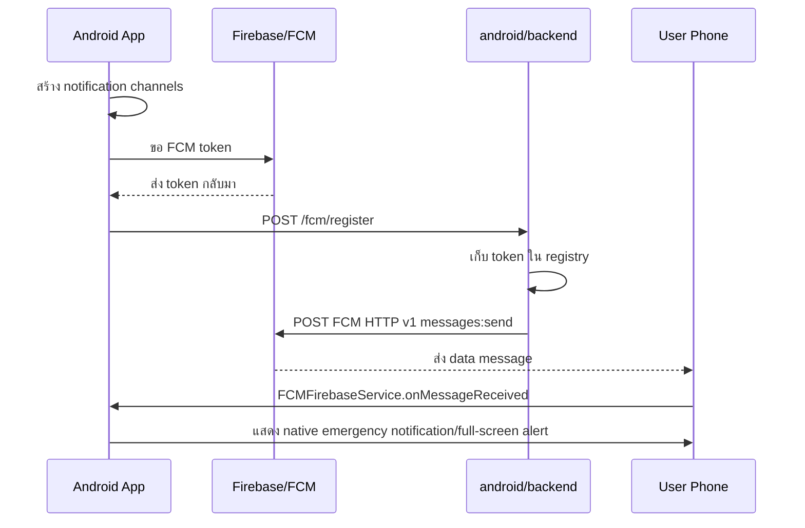

# สรุประบบแจ้งเตือนมือถือ D-MIND Android

วันที่: 2026-05-13

## เป้าหมาย

พัฒนาระบบแจ้งเตือนให้ D-MIND Android สามารถรับ push notification บนมือถือผู้ใช้งานได้ โดยใช้ Firebase Cloud Messaging (FCM) เป็น transport จาก backend และใช้ native Android notification/full-screen alert สำหรับแจ้งเตือนเหตุฉุกเฉินในเครื่อง

## สิ่งที่เพิ่มในแอป Android

| ส่วน | ไฟล์ | รายละเอียด |
| --- | --- | --- |
| Application startup | `android/app/src/main/kotlin/com/dmind/app/DMindApplication.kt` | สร้าง notification channels และ refresh FCM token ตอนเปิดแอป |
| Token registration | `android/app/src/main/java/com/dmind/app/util/FCMTokenRegistrar.java` | บันทึก token ในเครื่องและส่งไป backend `/fcm/register` |
| FCM receiver | `android/app/src/main/java/com/dmind/app/service/FCMFirebaseService.java` | รับ FCM data message และ trigger emergency notification |
| Notification rendering | `android/app/src/main/java/com/dmind/app/util/NotificationHelper.java` | สร้าง notification channel, vibration, full-screen intent |
| Emergency manager | `android/app/src/main/java/com/dmind/app/util/EmergencyNotificationManager.java` | รวม logic แจ้งเตือนภัยฉุกเฉิน |
| Full-screen UI | `android/app/src/main/java/com/dmind/app/activity/EmergencyAlertActivity.java` | หน้าจอแจ้งเตือนเต็มจอ/lock-screen |
| Android manifest | `android/app/src/main/AndroidManifest.xml` | ผูก `DMindApplication`, FCM service และ permissions |

## Flow การทำงาน



## Backend endpoints สำหรับแจ้งเตือน

| Method | Path | รายละเอียด |
| --- | --- | --- |
| POST | `/fcm/register` | รับ token จากมือถือ เก็บพร้อม `platform` และ `userId` |
| POST | `/notifications/send` | ส่งแจ้งเตือนผ่าน FCM HTTP v1 ไปยัง token, userId หรือ broadcast |

ตัวอย่างลงทะเบียน token:

```json
{
  "token": "<FCM_DEVICE_TOKEN>",
  "platform": "android",
  "userId": "anonymous"
}
```

ตัวอย่างส่งแจ้งเตือนแบบ broadcast:

```powershell
Invoke-RestMethod -Method Post `
  -Uri http://localhost:8080/notifications/send `
  -ContentType application/json `
  -Body '{"title":"แจ้งเตือนทดสอบ","message":"มีเหตุการณ์สำคัญในพื้นที่ของคุณ","alertType":"flood","broadcast":true}'
```

ตัวอย่างส่งแจ้งเตือนเฉพาะ token:

```json
{
  "title": "แจ้งเตือนทดสอบ",
  "message": "มีเหตุการณ์สำคัญในพื้นที่ของคุณ",
  "alertType": "flood",
  "token": "<FCM_DEVICE_TOKEN>"
}
```

ตัวอย่างส่งแจ้งเตือนตาม user id:

```json
{
  "title": "แจ้งเตือนเฉพาะผู้ใช้",
  "message": "โปรดตรวจสอบพื้นที่ปลอดภัยใกล้คุณ",
  "alertType": "storm",
  "userId": "anonymous"
}
```

## Payload ที่ backend ส่งไป FCM

Backend ส่งเป็น data-only message เพื่อให้แอปควบคุม native notification เอง:

```json
{
  "message": {
    "token": "<FCM_DEVICE_TOKEN>",
    "data": {
      "alert_type": "flood",
      "alert_title": "แจ้งเตือนทดสอบ",
      "alert_message": "มีเหตุการณ์สำคัญในพื้นที่ของคุณ"
    },
    "android": {
      "priority": "HIGH"
    }
  }
}
```

## Data keys ที่แอปรับ

| Key | จำเป็น | รายละเอียด |
| --- | --- | --- |
| `alert_type` | ใช่ | ประเภทภัย เช่น `flood`, `earthquake`, `storm`, `fire` |
| `alert_title` | ไม่บังคับ | หัวข้อแจ้งเตือน ถ้าไม่ส่งจะใช้ค่า default |
| `alert_message` | ไม่บังคับ | ข้อความแจ้งเตือน ถ้าไม่ส่งจะใช้ค่า default |

## ตำแหน่ง config และ key

ห้าม commit secret จริงลง repository

| รายการ | ตำแหน่ง | ใช้ทำอะไร |
| --- | --- | --- |
| `android/app/google-services.json` | ไฟล์ใน app module | Firebase Android client config สำหรับรับ FCM token/message |
| `DMIND_BACKEND_BASE_URL` | Gradle property | build ค่า `BuildConfig.BACKEND_BASE_URL` ให้แอป |
| `FCM_PROJECT_ID` หรือ `FIREBASE_PROJECT_ID` | backend environment variable | ระบุ Firebase/Google Cloud project สำหรับ FCM HTTP v1 |
| `GOOGLE_APPLICATION_CREDENTIALS` | backend environment variable | path ไป service-account JSON ของ backend |

ตัวอย่างตั้งค่า backend บน PowerShell:

```powershell
$env:FCM_PROJECT_ID="your-firebase-project-id"
$env:GOOGLE_APPLICATION_CREDENTIALS="C:\secure\dmind-firebase-service-account.json"
.\gradlew.bat :backend:run
```

ตัวอย่าง build app ให้ชี้ backend จริง:

```powershell
.\gradlew.bat :app:assembleDebug -PDMIND_BACKEND_BASE_URL=https://api.example.com
```

## Permission ที่เกี่ยวข้อง

| Permission | ใช้ทำอะไร |
| --- | --- |
| `POST_NOTIFICATIONS` | แสดง notification บน Android 13+ |
| `USE_FULL_SCREEN_INTENT` | เปิด emergency alert แบบเต็มจอ |
| `VIBRATE` | สั่นเตือนเหตุฉุกเฉิน |
| `WAKE_LOCK` | ช่วยปลุกเครื่องสำหรับเหตุฉุกเฉิน |
| `ACCESS_NOTIFICATION_POLICY` | DND bypass เมื่อผู้ใช้อนุญาต |

## ข้อจำกัดปัจจุบัน

- Backend token registry ยังเป็น in-memory registry ถ้า restart backend token จะหาย
- ยังไม่มี authentication/authorization สำหรับ `/notifications/send` ต้องเพิ่มก่อนใช้ production
- ยังไม่มีการจัดกลุ่มตามพื้นที่เสี่ยงหรือ geofence จาก server
- การรับแจ้งเตือนจริงต้องมี `google-services.json`, service account และ Firebase project ที่เปิด FCM แล้ว

## ตรวจสอบแล้ว

- `.\gradlew.bat :backend:test` ผ่าน
- `.\gradlew.bat :app:assembleDebug` ผ่าน
- `.\gradlew.bat :app:testDebugUnitTest` ผ่าน
